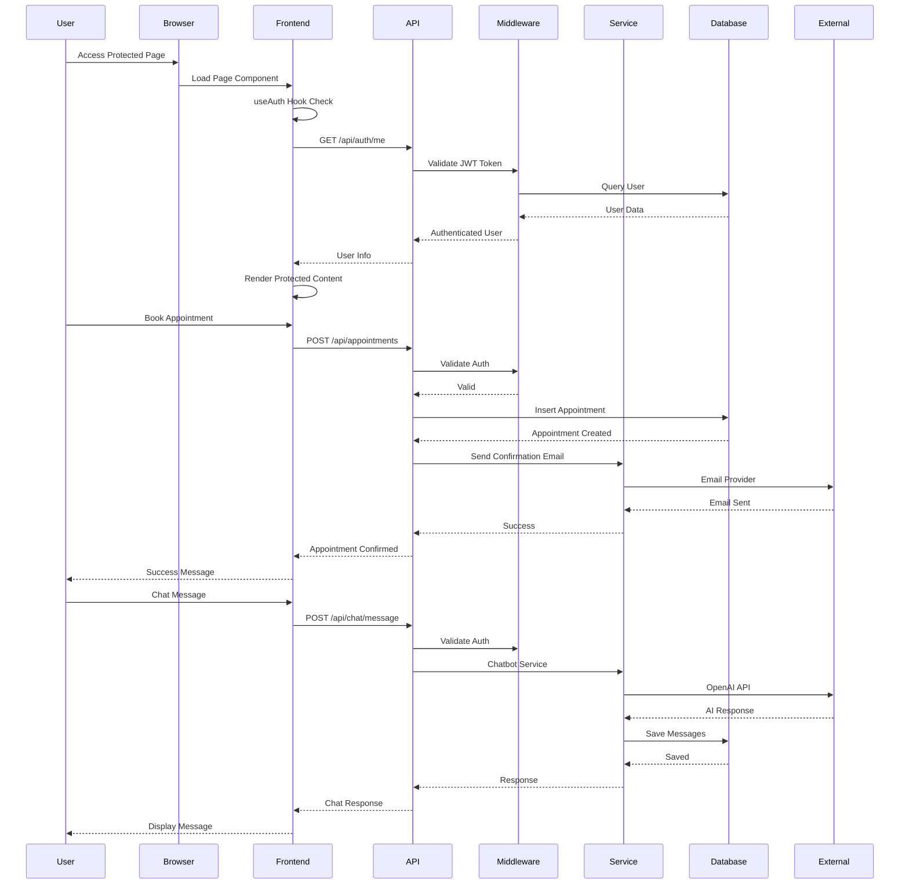
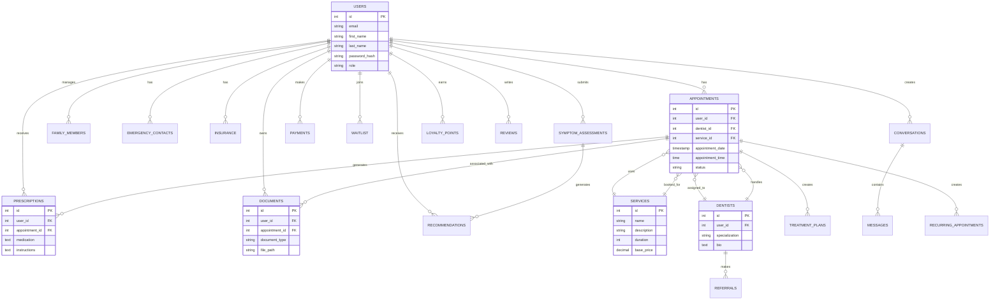
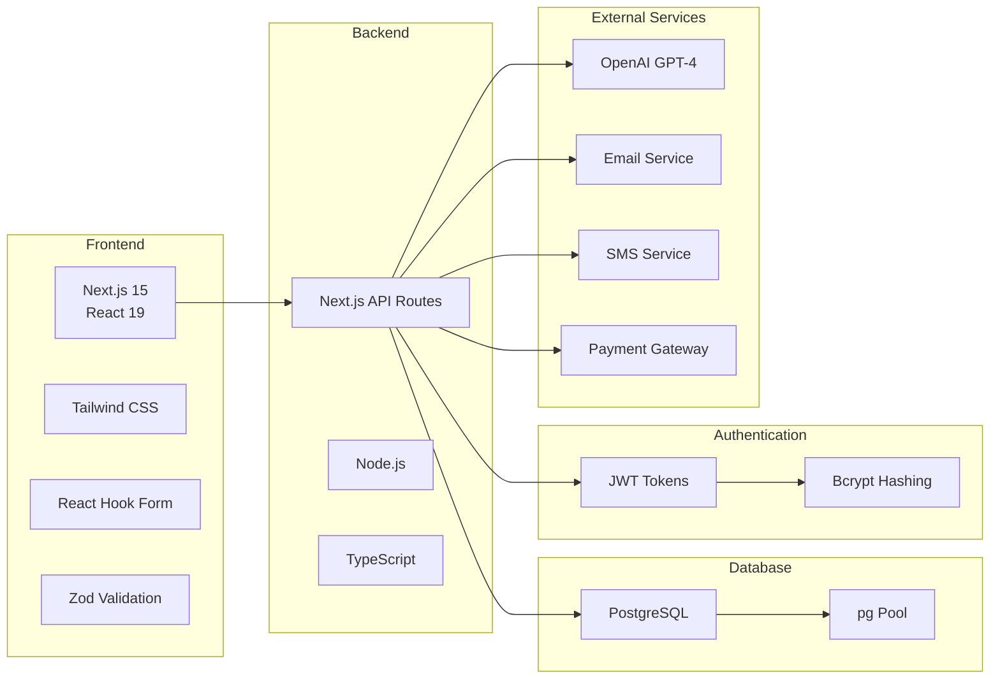

# Dental Tutor Application Architecture

## System Architecture Diagram

```mermaid
graph TB
    subgraph "Client Layer"
        Browser[Web Browser]
        User[User]
    end

    subgraph "Frontend - Next.js App Router"
        Home[Home Page /]
        Auth[Auth Pages<br/>/auth/login<br/>/auth/register]
        Dashboard[Dashboard<br/>/dashboard]
        
        subgraph "Appointment Management"
            Appointments[Appointments<br/>/appointments]
            BookAppt[Book Appointment<br/>/appointments/book]
            Reschedule[Reschedule<br/>/appointments/[id]/reschedule]
        end
        
        subgraph "Public Pages"
            Services[Services<br/>/services]
            ServiceDetail[Service Detail<br/>/services/[id]]
            Dentists[Dentists<br/>/dentists]
            DentistDetail[Dentist Profile<br/>/dentists/[id]]
            FAQs[FAQs<br/>/faqs]
            Office[Office Info<br/>/office]
        end
        
        subgraph "User Features"
            Profile[Profile<br/>/profile]
            Chat[Chat Assistant<br/>/chat]
            Waitlist[Waitlist<br/>/waitlist]
            Insurance[Insurance<br/>/insurance]
            Prescriptions[Prescriptions<br/>/prescriptions]
            Notifications[Notifications<br/>/notifications]
            Payments[Payments<br/>/payments]
            Support[Support<br/>/support]
        end
        
        subgraph "Components"
            Header[Header Component]
            Footer[Footer Component]
            ProtectedRoute[ProtectedRoute Component]
        end
        
        subgraph "Frontend Utils"
            useAuth[useAuth Hook]
            apiClient[API Client<br/>axios instance]
        end
    end

    subgraph "API Layer - Next.js API Routes"
        subgraph "Authentication"
            AuthAPI[Auth APIs<br/>/api/auth/login<br/>/api/auth/register<br/>/api/auth/me]
        end
        
        subgraph "Appointments"
            ApptAPI[Appointments API<br/>/api/appointments]
            ApptSlots[Appointment Slots<br/>/api/appointments/slots]
            ApptHistory[Appointment History<br/>/api/appointments/history]
            ApptUpcoming[Upcoming Appointments<br/>/api/appointments/upcoming]
            ApptReschedule[Reschedule<br/>/api/appointments/[id]/reschedule]
        end
        
        subgraph "Services & Dentists"
            ServicesAPI[Services API<br/>/api/services]
            DentistsAPI[Dentists API<br/>/api/dentists]
            ServicePricing[Service Pricing<br/>/api/service-pricing]
        end
        
        subgraph "User Management"
            UsersAPI[Users API<br/>/api/users/profile]
            FamilyMembers[Family Members<br/>/api/family-members]
            EmergencyContacts[Emergency Contacts<br/>/api/emergency-contacts]
        end
        
        subgraph "Medical Records"
            PrescriptionsAPI[Prescriptions API<br/>/api/prescriptions]
            TreatmentPlans[Treatment Plans<br/>/api/treatment-plans]
            DocumentsAPI[Documents API<br/>/api/documents]
            ImagesAPI[Images API<br/>/api/images]
        end
        
        subgraph "Communication"
            ChatAPI[Chat API<br/>/api/chat/message<br/>/api/chat/conversations]
            NotificationsAPI[Notifications API<br/>/api/notifications]
            ContactAPI[Contact API<br/>/api/contact]
        end
        
        subgraph "Financial"
            PaymentsAPI[Payments API<br/>/api/payments/process<br/>/api/payments/history]
            TransactionsAPI[Payment Transactions<br/>/api/payments/transactions]
            InsuranceAPI[Insurance API<br/>/api/insurance]
        end
        
        subgraph "Features"
            WaitlistAPI[Waitlist API<br/>/api/waitlist]
            RecurringAppt[Recurring Appointments<br/>/api/recurring-appointments]
            UrgentAppt[Urgent Appointments<br/>/api/urgent-appointments]
            SymptomAssessment[Symptom Assessment<br/>/api/symptom-assessment]
            RecommendationsAPI[Recommendations<br/>/api/recommendations]
            ReferralsAPI[Referrals API<br/>/api/referrals]
            ReviewsAPI[Reviews API<br/>/api/reviews]
            LoyaltyAPI[Loyalty Points<br/>/api/loyalty]
        end
        
        subgraph "Content & Support"
            FAQsAPI[FAQs API<br/>/api/faqs]
            DentalTips[Dental Tips<br/>/api/dental-tips]
            CareInstructions[Care Instructions<br/>/api/care-instructions]
            PrepInstructions[Prep Instructions<br/>/api/preparation-instructions]
            PainManagement[Pain Management<br/>/api/pain-management]
            PromoOffers[Promotional Offers<br/>/api/promotional-offers]
            OfficeAPI[Office Info<br/>/api/office]
            AlertsAPI[Alerts API<br/>/api/alerts]
        end
        
        subgraph "Middleware"
            AuthMiddleware[Auth Middleware<br/>JWT Validation]
            CORSMiddleware[CORS Middleware]
        end
    end

    subgraph "Business Logic Layer"
        subgraph "Services"
            ChatbotService[Chatbot Service<br/>OpenAI Integration]
            EmailService[Email Service]
            SMSService[SMS Service]
            RemindersService[Reminders Service]
        end
        
        subgraph "Auth Utils"
            JWTUtils[JWT Utils<br/>Token Generation/Validation]
            PasswordUtils[Password Utils<br/>bcrypt Hashing]
        end
        
        subgraph "Utilities"
            Logger[Logger]
            ErrorHandler[Error Handler]
            APIUtils[API Utils]
        end
    end

    subgraph "Database Layer - PostgreSQL"
        subgraph "Core Tables"
            UsersTable[(Users)]
            AppointmentsTable[(Appointments)]
            ServicesTable[(Services)]
            DentistsTable[(Dentists)]
        end
        
        subgraph "User Related"
            FamilyMembersTable[(Family Members)]
            EmergencyContactsTable[(Emergency Contacts)]
            InsuranceTable[(Insurance)]
            UserProfilesTable[(User Profiles)]
        end
        
        subgraph "Medical Records"
            PrescriptionsTable[(Prescriptions)]
            TreatmentPlansTable[(Treatment Plans)]
            DocumentsTable[(Documents)]
            PatientImagesTable[(Patient Images)]
            FormsTable[(Forms)]
        end
        
        subgraph "Communication"
            ConversationsTable[(Conversations)]
            MessagesTable[(Messages)]
            NotificationsTable[(Notifications)]
        end
        
        subgraph "Financial"
            PaymentsTable[(Payments)]
            PaymentTransactionsTable[(Payment Transactions)]
            InvoicesTable[(Invoices)]
        end
        
        subgraph "Features"
            WaitlistTable[(Waitlist)]
            RecurringAppointmentsTable[(Recurring Appointments)]
            SymptomAssessmentsTable[(Symptom Assessments)]
            RecommendationsTable[(Recommendations)]
            ReferralsTable[(Referrals)]
            ReviewsTable[(Reviews)]
            LoyaltyPointsTable[(Loyalty Points)]
        end
        
        subgraph "Content"
            FAQsTable[(FAQs)]
            DentalTipsTable[(Dental Tips)]
            CareInstructionsTable[(Care Instructions)]
            PrepInstructionsTable[(Prep Instructions)]
            PainManagementTable[(Pain Management)]
            PromoOffersTable[(Promotional Offers)]
            OfficeInfoTable[(Office Info)]
            AlertsTable[(Alerts)]
        end
    end

    subgraph "External Services"
        OpenAI[OpenAI API<br/>GPT-4]
        EmailProvider[Email Provider]
        SMSProvider[SMS Provider]
        PaymentGateway[Payment Gateway<br/>Stripe/PayPal]
    end

    %% User Flow
    User --> Browser
    Browser --> Home
    Browser --> Auth
    Browser --> Dashboard
    
    %% Frontend Navigation
    Dashboard --> Appointments
    Dashboard --> Profile
    Dashboard --> Chat
    Dashboard --> Services
    Dashboard --> Dentists
    
    %% Protected Routes
    ProtectedRoute --> useAuth
    useAuth --> AuthAPI
    
    %% Frontend to API
    Home --> apiClient
    Auth --> AuthAPI
    Dashboard --> apiClient
    Appointments --> ApptAPI
    BookAppt --> ApptAPI
    Reschedule --> ApptReschedule
    Services --> ServicesAPI
    ServiceDetail --> ServicesAPI
    Dentists --> DentistsAPI
    DentistDetail --> DentistsAPI
    Profile --> UsersAPI
    Chat --> ChatAPI
    Waitlist --> WaitlistAPI
    Insurance --> InsuranceAPI
    Prescriptions --> PrescriptionsAPI
    Notifications --> NotificationsAPI
    Payments --> PaymentsAPI
    FAQs --> FAQsAPI
    Office --> OfficeAPI
    
    %% API Client
    apiClient --> AuthAPI
    apiClient --> ApptAPI
    apiClient --> ServicesAPI
    apiClient --> DentistsAPI
    
    %% API Middleware
    AuthAPI --> AuthMiddleware
    ApptAPI --> AuthMiddleware
    UsersAPI --> AuthMiddleware
    ChatAPI --> AuthMiddleware
    PaymentsAPI --> AuthMiddleware
    
    %% API to Services
    ChatAPI --> ChatbotService
    NotificationsAPI --> EmailService
    NotificationsAPI --> SMSService
    RemindersService --> EmailService
    RemindersService --> SMSService
    
    %% Services to External
    ChatbotService --> OpenAI
    EmailService --> EmailProvider
    SMSService --> SMSProvider
    PaymentsAPI --> PaymentGateway
    
    %% Auth Flow
    AuthAPI --> JWTUtils
    AuthAPI --> PasswordUtils
    AuthMiddleware --> JWTUtils
    
    %% API to Database
    AuthAPI --> UsersTable
    ApptAPI --> AppointmentsTable
    ApptAPI --> ServicesTable
    ApptAPI --> DentistsTable
    ServicesAPI --> ServicesTable
    DentistsAPI --> DentistsTable
    UsersAPI --> UsersTable
    UsersAPI --> UserProfilesTable
    FamilyMembers --> FamilyMembersTable
    EmergencyContacts --> EmergencyContactsTable
    ChatAPI --> ConversationsTable
    ChatAPI --> MessagesTable
    PrescriptionsAPI --> PrescriptionsTable
    TreatmentPlans --> TreatmentPlansTable
    DocumentsAPI --> DocumentsTable
    ImagesAPI --> PatientImagesTable
    NotificationsAPI --> NotificationsTable
    PaymentsAPI --> PaymentsTable
    PaymentsAPI --> PaymentTransactionsTable
    InsuranceAPI --> InsuranceTable
    WaitlistAPI --> WaitlistTable
    RecurringAppt --> RecurringAppointmentsTable
    SymptomAssessment --> SymptomAssessmentsTable
    RecommendationsAPI --> RecommendationsTable
    ReferralsAPI --> ReferralsTable
    ReviewsAPI --> ReviewsTable
    LoyaltyAPI --> LoyaltyPointsTable
    FAQsAPI --> FAQsTable
    DentalTips --> DentalTipsTable
    CareInstructions --> CareInstructionsTable
    PrepInstructions --> PrepInstructionsTable
    PainManagement --> PainManagementTable
    PromoOffers --> PromoOffersTable
    OfficeAPI --> OfficeInfoTable
    AlertsAPI --> AlertsTable
    
    %% Database Relationships
    UsersTable --> AppointmentsTable
    UsersTable --> PrescriptionsTable
    UsersTable --> DocumentsTable
    UsersTable --> FamilyMembersTable
    UsersTable --> EmergencyContactsTable
    AppointmentsTable --> ServicesTable
    AppointmentsTable --> DentistsTable
    AppointmentsTable --> PrescriptionsTable
    AppointmentsTable --> TreatmentPlansTable
    DentistsTable --> AppointmentsTable
    ServicesTable --> AppointmentsTable

    style Browser fill:#e1f5ff
    style Dashboard fill:#c8e6c9
    style AuthAPI fill:#fff9c4
    style ChatbotService fill:#f8bbd0
    style OpenAI fill:#ffccbc
    style UsersTable fill:#e1bee7
    style AppointmentsTable fill:#e1bee7
    style ServicesTable fill:#e1bee7
    style DentistsTable fill:#e1bee7
```

## Component Interaction Flow



## Database Entity Relationship



## Technology Stack



